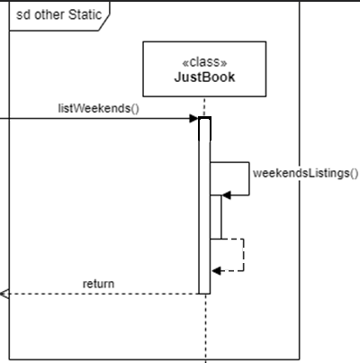
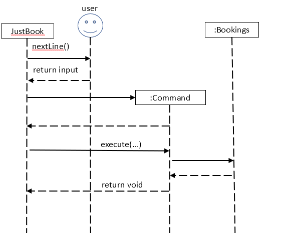
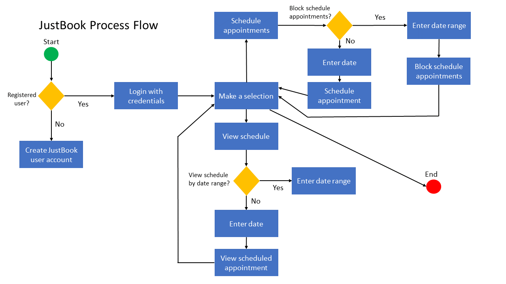

# Developer Guide

## Acknowledgements

- [docs.oracle.com Java time References](https://docs.oracle.com/en/java/javase/11/docs/api/java.base/java/time/LocalDateTime.html) 
- [Java Streams Reference](http://tutorials.jenkov.com/java-functional-programming/streams.html)
- Raoul-Gabriel Urma, Mario Fusco, Alan Mycroft, *Modern Java in Action: Lambdas, streams, functional and reactive programming 2nd Edition*, Manning, 2018. 
- Team members: **Wan Yin, Hanna, Yeu Chai and Sze Chun**  

## Design

**JustBook Command Line App** leverages on the help of a total five Java classes, viz. **JustBook, Bookings, AddCommand, 
  DeleteCommand and HelpCommand** created by the Team. It makes optimal use of Java Stream and the latest java time APIs,
  e.g. LocalDateTime and LocalDate, among others, together with a judicious choice of data structures, to allow a single 
  user good at the keyboard to make and register bookings / appointments online fast: 

- Each user booking entry is stored in an `Arraylist<Bookings>` data structure (which will be sorted before each `show` 
  listing process - this is to  allow for editing or deleting direct using the onscreen listings). 
  
- The **Bookings** class will capture the user booking description, the scheduled start localDateTime and end 
  localDateTime data belonging to a specific booking entry. 
  
- Another data structure chosen for efficient search/retrieval - `HashMap<LocalDate, LocalDate>` - is used to store a 
  blocklist consisting of blocking periods where the user will not be able to make any bookings.  

## Implementation

### Show weekends / we feature

#### Highlights:

 

Fig 1. - JustBook Class Diagram Sample  

Fig 2. - Sequence Diagram Illustration  

Fig 3. - Sequence Diagram  Illustration  

The `show weekends` or `show we` mechanism is facilitated by two JustBook Class-level helper methods, namely, 
**listWeekends()** and **weekendListings()**. 

The plan of this feature is to display quickly all the weekends and their booking listings of the current month, if any,
to the console, arranged in chronological order - starting from the weekend nearest to the point of date of entry of the
user, when he or she enters the CLI command.

The first method **listWeekends()** will accomplish the bulk of the above work while working in synchronicity with the
second helper method **weekendListings()**, which mainly formats the display to group all weekend bookings by their 
respective weekend headers, and searches the online appointment database to extract out only the weekend entries to
display for the month.

Fig 3. - Sequence Diagram for User Input   

#### Design considerations:
Considerations in the design of both methods have been specially given for the optimization of both operations in terms
of time and space complexity, 
- in terms of unnecessary non-weekend database searches skipped 
  - once a valid weekend date has been processed proper - until the next valid weekend processing begins, 
- and the deployment of an **EnumSet** (with the two DayOfWeek weekends values) 
  - to afford quick comparison operations during the sifting out of the weekend
  dates, from the generated stream of dates, bracketed by the current day date to the end of the month.

We tried to adhere to a Command design pattern as much as possible. The design pattern was implemented at the later stages of
the sprints, since we aimed to develop a MVP as fast as possible (Scalability was less of a concern), which did not have optimal design at the start. Afterwards, in the later sprints,
more features were refactored into the Command design pattern.

In terms of design principles, for the refactored Command classes, they have adhered to Single Responsibility Principle rather well. This allows strong cohesion with minimal coupling for those
classes. However, certain principles such as Open-Closed Principle was not adhered as much at the start, due the priority of developing an MVP product first.
Thus, certain sections may not be closed for modifications, such as one of the identified areas (the JustBook class) but are seen in the refactored sections.
We have attempted to keep the code KISS as much as possible, whereby the program flow is rather simplistic. Furthermore, variable names and functions method names are also rather intuitive, 
improving the readability for the code reader.

In a nutshell, the design patterns and principles were not the strongest focus at the start, but as the product became more developed, it began to be more object oriented in its design.
With this approach, the earlier sprints allowed more features to be developing while keeping in check the complexity (such as coupling) of the application through refactoring.

## Product scope
**Target user profile:**

- has a need to manage a number of fast bookings
- prefer desktop apps vs other types
- can type fast
- prefers using the keyboard over mouse interactions
- is reasonably comfortable using CLI apps

**Value proposition:** manage contacts faster than a typical mouse/GUI driven app

### Target user profile

Target User: John

Age: 18 (typical)

Occupation: Student

Education: Currently in Poly or JC

Commitments: CCAs, recreational activities, Studies

Traits: Is technologically literate, active in activities, comfortable typing commands

Our target user is a Student that is currently schooling. As an active student, the Target User has multiple activities that may be hard to keep track of. With the scheduler, John will be able to plan and organize multiple appointments at the same time.

### Value proposition

JustBook provides a user-friendly, consistent and error-free interface, as well as helpful message feedback or alerts to users, throughout the app use. The scheduler can be customized into working on the basis of various time durations (6 months, monthly, weekly etc.). Using the CLI-type interface, the user will be able to edit multiple appointments easily with minimal commands / single commands.

Users are able to make, check, delete, view, change, and source in real-time for available slots for appointments using this application. This application will display a range of time slots available for users to choose from, may also list available dates and unavailable dates when the User is trying to schedule an appointment. The User can also choose to work on a 6-calendar-months view / basis (coming feature), or per month, per week, down to a day’s view / basis.  

Possible enhancements include appointment data printout, a file backup in the background to act as a redundancy measure for unforeseen disruption, alerts for the User if so scheduled, etc. 

Our Value Proposition is that our scheduler provides, throughout the app use, a consistent, user-friendly and error-free interface, assisting message feedback or alerts and a capability to suggest time slots to the user, in addition to the time slots available (coming feature). The scheduler can be customized to work on the basis of various time durations (monthly, weekly, daily etc.). Using the CLI-type interface, the user will be able to edit multiple appointments easily with minimal commands / single commands.

## User Stories

|Version| As a ... | I want to ... | So that I can ...|
|--------|----------|---------------|------------------|
|v1.0|new user|see help usage instructions|refer to them when I forget how to use the application|
|v1.0|regular user|I can add in a booking entry in one line|make an entry and have it stored online fast|
|v1.0|a quick user|I can edit a booking entry description|modify an entry description easily at will|
|v1.0|date planner|I find a booking item by date|locate a to-do without having to go through the entire list|
|v1.0|efficient student|I can order all my tasks and appointment by their due date|order all my tasks and appointment by their due date|
|v1.0|systematic student|I can see my list upfront |know what tasks I have clear for the day|
|v1.0|active student|I can view the block of outstanding schedules for the month displayed (coming feature)|check if I can add further bookings for that month|
|v1.0|fast-moving student|I can view the the day's block of remaining schedules|remind myself of the schedules done and which ones left to attend to that day|
|v1.0|studious student|I can input a blocking period into the database|so that I'm unable to book within that critical period|
|v2.0|student|I can save or load at start up my appointments and schedule|not need to re-create them everytime I log in|
|v2.0|structured student|I can see my appointments arranged together and tasks arranged together|have a clear distinct view of appointments and tasks|
|v2.0|student who always does late minute work|I want to see tasks or appointments going to be due being highlighted to me in ordered deadline date and time|can meet the deadline (coming feature)|
|v2.0|social student|I can view the block of weekend outstanding schedules for the entire current month displayed|check if I can add further bookings for the weekends|
|v2.0|busy student|I can quit the application immediately with an automatic save|move on to my other activities quickly|

## Non-Functional Requirements
1. Users are able to run the application as long as Java11 is installed
2. The application has been designed to handle up to 100’s of user appointments optimally without affecting its performance.
3. The application should preferably be executable on Windows OS or compatible software-emulated terminal.
4. User-friendly features incorporated in helpful messages feedback and diagnostic prompts (more to come) 

## JustBook's Process Workflow

Fig 4. - JustBook App Activity Diagram  
The diagram illustrates the possible branches leading to various outcomes based on the user's decisions.

The model illustrates a regular process flow of a user starting up the JustBook application. The user launches the 
application and is prompted to log in. If the user does not have an account within the application, the user will be 
prompted to create an account and redirected to log in again. Following that, the user is presented with options on 
utilising the application as illustrated in the diagram. 

## Glossary

* **Mainstream OS** - Windows, Linux, Unix, OS-X
* **JustBook App**  - A single-user command line app for making and storing student bookings online 
* **CLI**           - Command Line Interface
* **booking**       - A typed entry consisting of booking text description, a start DateTime and end DateTime 
* **ISO (time standard)** - For Java time Standards, it follows this format: "yyyy-MM-dd HH:mm"
* **DateTime**     - Java LocalDateTime implemented with format as "yyy-M-d HH:mm", using a 24 hr format

## Instructions for manual testing

- Ensure Java jdk 11 is installed
- Download the justbook.jar file from Release v2.0
- Obtain a sample test file, e.g. justbook.txt with saved entries (correctly formatted)
- Copy the sample test file to a local folder named data
- start up the app, eg.` java -jar justbook.jar` via a windows cmd or compatible terminal
- Type in a username of your choice
- Type `show --all` or `show all` to check the display list tallies with those saved in the justbook.txt file
- Sample instruction:

## Instructions for IO/Regression testing
1. Navigate to text-ui-test folder
2. Depending on your (User's) OS, if Windows, run runtestmain.bat, if Linux or macOS, navigate to the test folders and run runtest.sh
3. The CMD window or shell output will display if the comparison between the expected output and actual output are the same
4. If there are any differences, they will be displayed at the CMD or shell window as well.
5. The regression test would have passed if no differences are found.
